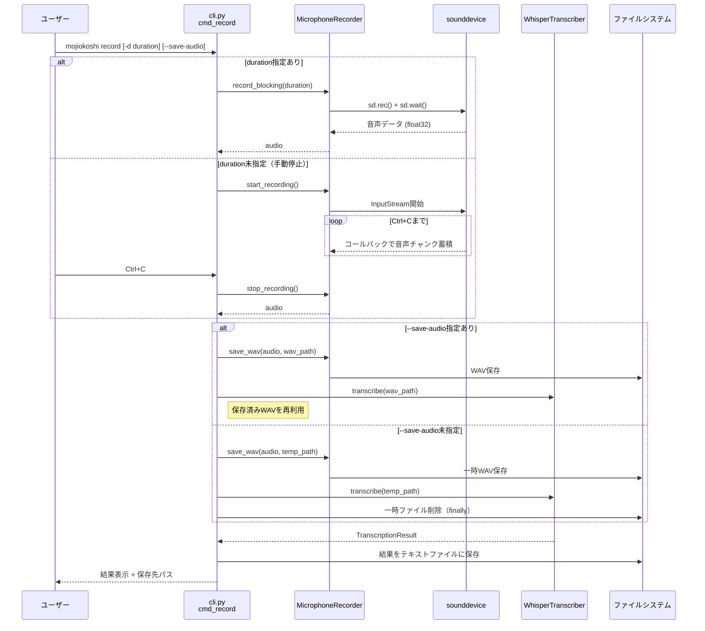
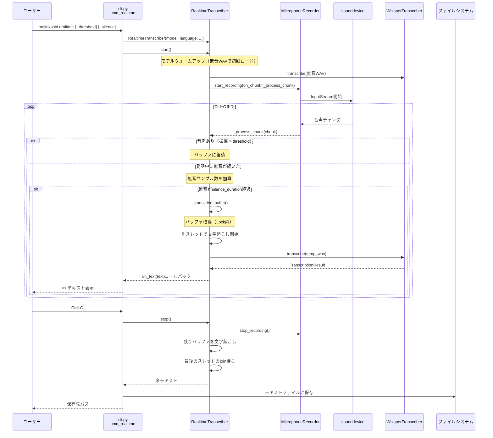
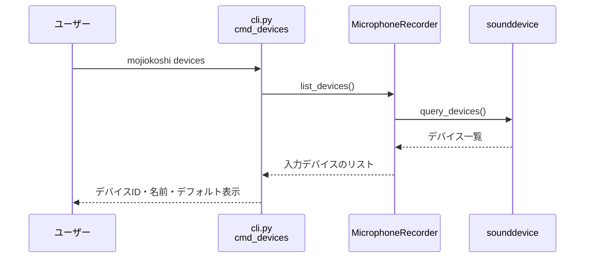

# コマンド別シーケンス図

## 1. `mojiokoshi file` — 音声ファイルの文字起こし

```mermaid
sequenceDiagram
    participant User as ユーザー
    participant CLI as cli.py<br>cmd_file
    participant WT as WhisperTranscriber
    participant Whisper as mlx-whisper
    participant FS as ファイルシステム

    User->>CLI: mojiokoshi file <input> [-o output]
    CLI->>FS: 入力ファイルの存在確認
    alt ファイルが存在しない
        CLI-->>User: エラー終了
    end
    CLI->>WT: WhisperTranscriber(model, language)
    CLI->>WT: transcribe(input_path)
    WT->>Whisper: mlx_whisper.transcribe()
    Whisper-->>WT: {text, segments, language}
    WT-->>CLI: TranscriptionResult
    CLI->>FS: 結果をテキストファイルに保存
    CLI-->>User: 結果表示 + 保存先パス
```

## 2. `mojiokoshi record` — 録音して文字起こし

## 3. `mojiokoshi realtime` — リアルタイム文字起こし

## 4. `mojiokoshi devices` — デバイス一覧表示

## 5. `mojiokoshi-summarize` — 文字起こしテキストの校正・要約

```mermaid
sequenceDiagram
    participant User as ユーザー
    participant Main as summarize.py<br>main
    participant Sum as summarize()
    participant Ollama as Ollama API
    participant FS as ファイルシステム

    User->>Main: mojiokoshi-summarize <input> [-m model] [-c correction-model]
    Main->>FS: 入力テキスト読み込み
    Main->>Sum: summarize(text, model, correction_model)

    Note over Sum: Stage 1: テキスト校正
    Sum->>Sum: split_into_chunks_with_context(text)
    loop 各チャンク
        Sum->>Sum: correct_chunk(context, main_text, model)
        Sum->>Ollama: POST /api/chat（校正プロンプト + CorrectedChunkスキーマ）
        Ollama-->>Sum: {corrected_text: "..."}
    end
    Note over Sum: 校正済みチャンクを結合

    Note over Sum: Stage 2: 議事録生成
    Sum->>Ollama: POST /api/chat（要約プロンプト + MeetingNotesスキーマ）
    Ollama-->>Sum: {summary, key_points, ...}
    Sum->>Sum: to_markdown(notes, corrected_text)
    Sum-->>Main: Markdown文字列

    Main->>FS: Markdownファイルに保存
    Main-->>User: 保存先パス
```

